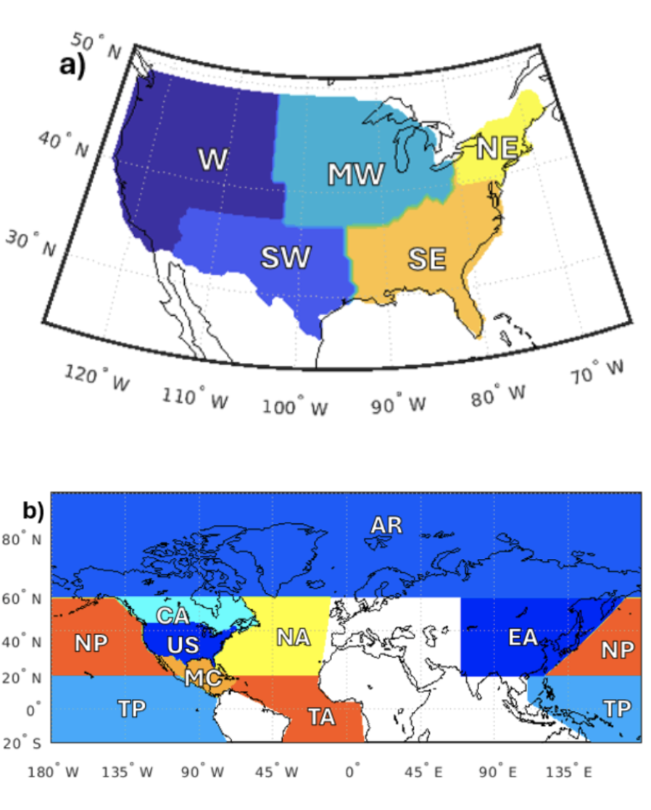

*Talk given at [SIAM-UQ](https://www.siam.org/conferences-events/siam-conferences/uq26/) on a session on [Hybrid AI-Statistical Approaches for Environmental Spatio-Temporal Processes](https://meetings.siam.org/sess/dsp_programsess.cfm?SESSIONCODE=87145)*

Extreme temperatures cause more than $100 billion in damages annually within the United States alone. This means it is of great societal importance to improve predictive skill of these temperature extremes on subseasonal timescales (2-6 weeks) beyond that of the traditional physics-based model. In this study, we evaluate the performance of statistical-machine learning (ML) methods, including Echo State Networks (ESN) and Random Forests (RF), for forecasting weekly average temperatures across five U.S. regions, with forecast horizons ranging from one to four weeks. In addition to point forecasts, we assess each model's ability to predict extremes, defined as weekly temperature anomalies exceeding one standard deviation from climatology.
All ML models are benchmarked against two standard baselines: a persistence model and a climatology-plus-trend model. We additionally compare feature importance between models. Our results provide a comprehensive comparison of ML methods for subseasonal temperature forecasting and offer new insights into the complexity of feature relevance across lead times and regions.

*SNL is managed and operated by NTESS under DOE NNSA contract DE-NA0003525. SAND2025-09300A.*

[Slides](https://goodekat.github.io/presentations/2026-siam-uq/slides.html)

{width="60%"}

