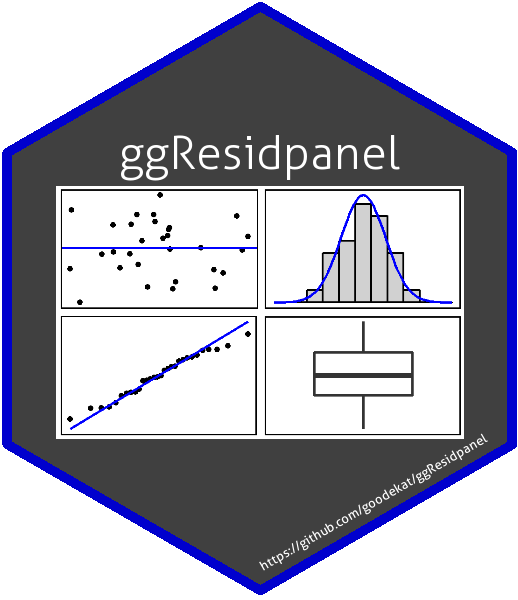
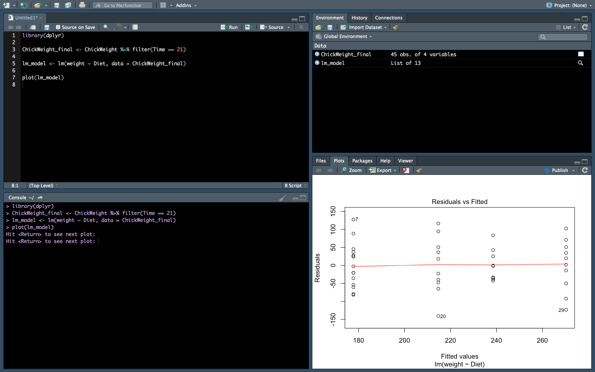
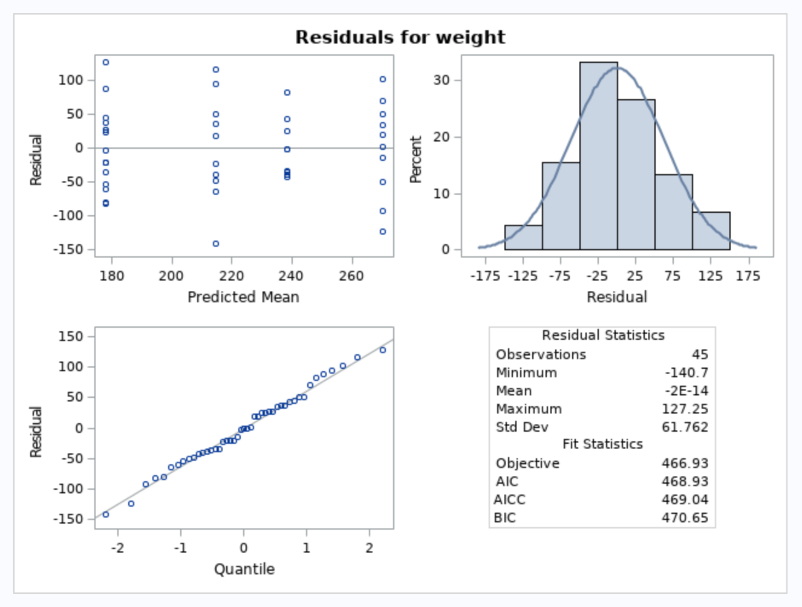

{width=25%}

```{r setup, include = FALSE}
knitr::opts_chunk$set(echo = TRUE, warning = FALSE, message = FALSE, fig.align = 'center')

library(dplyr)
library(ggplot2)
```

# Motivation

### Example dataset:

As consultants, we encounter projects from many different disciplines. Our clients are often fitting linear models. They may have data similar to the `ChickWeight` data found in the R datasets. 

```{r}
# Look at the first few rows of the data
head(ChickWeight)

# Look at the structure of the data
str(data.frame(ChickWeight))
```

Suppose that the client would like to determine if there is a difference in average chick weights measured on the final measurement day (day 21) between the diet treatments.

```{r}
# Subset the data to only inlcude the measurements taken on day 21 
# (the final measurement time)
ChickWeight_final <- ChickWeight %>% filter(Time == 21)

# Create boxplots of the chick weights for each diet
ggplot(ChickWeight_final, aes(x = Diet, y = weight)) + 
  geom_boxplot() + 
  labs(y = "Weight")
```

### An analysis of the data:

The client may come to us with the following analysis and ask if what they have done is correct.

```{r}
# Fit a linear model
(lm_model <- lm(weight ~ Diet, data = ChickWeight_final))

# Look at the anova table with type III sums of squares 
# (there are a different number of chicks per treatment)
car::Anova(lm_model, type = "III")

# Look at the lsmeans and pairwise differences
emmeans::emmeans(lm_model, pairwise ~ Diet)
```

What has been done seems reasonable, but the client has forgotten to look at residual plots to check the model assumptions. This is a common oversight.

### Some options for checking residuals:

#### (1) Create the plots from scratch using base R

- relatively simple
- have to create each plot separately
- not created using ggplot2
- no bands around the normal quantile plot
- cannot see both plots at the same time

```{r}
# Create a residual plot
plot(resid(lm_model) ~ fitted(lm_model))
abline(h = 0)

# Create a normal quantile plot
qqnorm(resid(lm_model))
qqline(resid(lm_model))
```

#### (2) Create the plots using the `plot` function

- super simple code
- have to hit enter each time you want to move to the next plot when run in the console
- must create all plots in order to go back to look at the first plot
- shows some plots that we may not care about
- also not created using ggplot2
- again no bands around the normal quantile plot
- againg cannot see both plots at the same time

```{r}
# Create residual diagnostic plots
plot(lm_model)
```



<div style="margin-bottom:25px;"></div>

#### (3) Create the plots using ggplot2

- plots in the ggplot2 framework
- have to create a new data frame (cannot not just input the model)
- must create each plot separately
- cannot see both plots at the same time

```{r}
# Create a dataset with the residuals and fitted values
ggdata <- data.frame(resid = resid(lm_model),
                     fitted = fitted(lm_model))
head(ggdata)

# Create a residual plot
ggplot(ggdata, aes(x = fitted, y = resid)) + 
  geom_point() + 
  geom_hline(yintercept = 0) + 
  labs(x = "Fitted Values", y = "Residuals")

# Create a normal quantile plot
library(qqplotr)
ggplot(ggdata, mapping = aes(sample = resid)) +
    stat_qq_band() +
    stat_qq_line() +
    stat_qq_point() +
    labs(x = "Theoretical Quantiles", y = "Sample Quantiles")
```

### Diagnostic plots in SAS:

Many of the clients we work with use SAS. We both like the `residualpanel` plot option in proc mixed, because it provides a panel of residual diagnostic plots. 

The following SAS code fits the same linear model in SAS and outputs the residual panel of plots shown below.

```{eval = FALSE}
proc import out = ChickWeight_final
			datafile = '/folders/myfolders/ggResidpanel example/ChickWeight_final.csv'
			dbms = csv
			replace;
	getnames = yes;
	datarow = 2;
run;

proc mixed data = ChickWeight_final plots = residualpanel;
	class Diet;
	model weight = Diet;
run;
```

<center>
{width=75%}
<center>

### Inspiration for ggResidpanel

We were inspired by the SAS residual panel to create an R package that provided an easy way to view multiple diagnostic plots created using ggplot2 at the same time. Additionally, we wanted the package to...

- be helpful for less experienced R users
- allow for the choice of which plots to include in the panel
- allow for the choice of which type of residual to be plotted
- include interactive graphs that could be used to identify outliers

This led to the creation of ggResidpanel.

```{r}
library(ggResidpanel)
resid_panel(lm_model)
```

# Installing ggResidpanel

Follow these instructions to install ggResidpanel.

```{r eval = FALSE, echo = TRUE}
# (1) Install the package devtools (if not already installed)
install.packages("devtools")

# (2) Install ggResidpanel from the GitHub repository
devtools::install_github("goodekat/ggResidpanel")

# (3) Load the package
library(ggResidpanel)
```

# Package Details

## `resid_panel`

## `resid_interact`

The function `resid_interact` creates interactive versions of the residual diagnostic plots. `resid_interact` makes use of plotly to show additional information about a point when the mouse is hovered over it. The tool tip shows:

- the (x,y) coordinates
- the response variable value 
- the predictor variables values
- the observation number

All formatting options that were available with `resid_panel` are available with `resid_interact`.

### Available plots:

For now, only one plot can be shown at a time. The available plots are as follows:

- `boxplot`: A boxplot of residuals
- `cookd`: A plot of Cook's D values versus observation numbers
- `hist`: A histogram of residuals
- `index`: A plot of residuals versus observation numbers
- `ls`: A location scale plot of the residuals
- `qq`: A normal quantile plot of residuals
- `lev`: A plot of leverage values versus residuals
- `resid`: A plot of residuals versus predicted values
- `yvp`: A plot of observed response values versus predicted values

### Example: 

Below are some interactive versions of residual plots created using `resid_interact`.

```{r}
resid_interact(lm_model, type = "standardized", title.opt = FALSE)
resid_interact(lm_model, plot = "cookd", theme = "grey")
```

## `resid_auxpanel`

Since the function `resid_panel` only works with certain model types, we wanted to include an additional function (or an auxiliary function) that can be used with any model. This led to the creation of `resid_auxpanel`.

Similar to `resid_panel`, `resid_auxpanel` creates a panel of residual diagnostic plots, but instead of inputting a model in the function, the residuals and fitted values are input. This causes some plot options to no longer be available. However, all formatting options are still available with `resid_auxpanel`.

### Options for `plots`: 

- `all`: This creates a panel of all plot types included in the package that are available for `resid_auxpanel`
- `default`: This creates a panel of a residual plot, a normal quantile plot of the residuals, an index plot of the residuals, and a histogram of the residuals. (This is the default option.)
- `SAS`: This creates a panel of a residual plot, a normal quantile plot of the residuals, a histogram of the residuals, and a boxplot of the residuals. 
- A vector of individual plots can also be specified.

### Available plots:

- `boxplot`: A boxplot of residuals
- `hist`: A histogram of residuals
- `qq`: A normal quantile plot of residuals
- `resid`: A plot of residuals versus predicted values

### Example:

Let us fit a random forest model to the `mtcars` data to predict the mpg based on all other variables. We would like to look at the residuals to see if there is any pattern in the residuals in relationship to the fitted values. A histogram of the residuals is also requested.

```{r}
# Fit a random forest model to the mtcars data to predict the mpg
rf_model <- randomForest::randomForest(x = mtcars[,2:11], y = mtcars[,1])

# Obtain the predictions from the model on the observed data
rf_pred <- predict(rf_model, mtcars[,2:11])

# Obtain the residuals from the model
rf_resid <- mtcars[,1] - rf_pred

# Create a panel with the residual and index plot
resid_auxpanel(rf_resid, rf_pred, plots = c("resid", "index"), theme = "classic")
```

# Future Work

- Add a function that accepts multiple models to compare the residuals
- Add a function that plots the residuals versus the predictor variables
- Create a grid of interactive plots
- Integrate an option for a “theme object” to allow users to further adjust the formatting using all capabilities available in ggplot2
- Include an option for standardized residuals with ‘lmer’ and ‘glmer’ models


